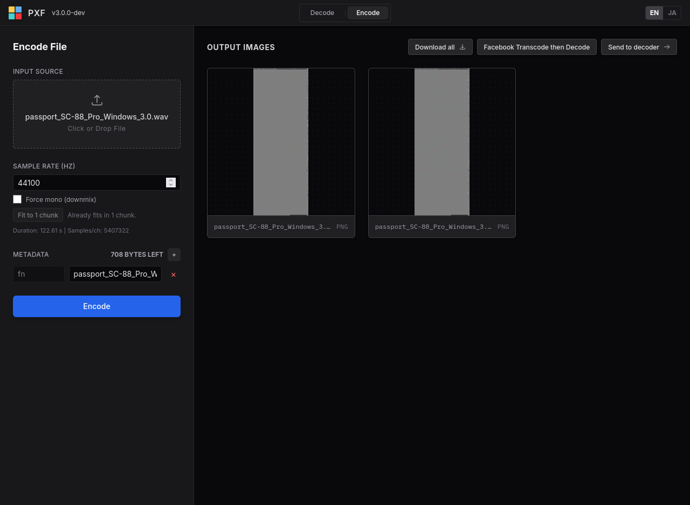
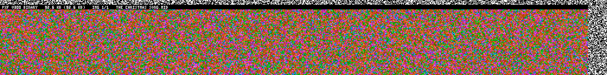
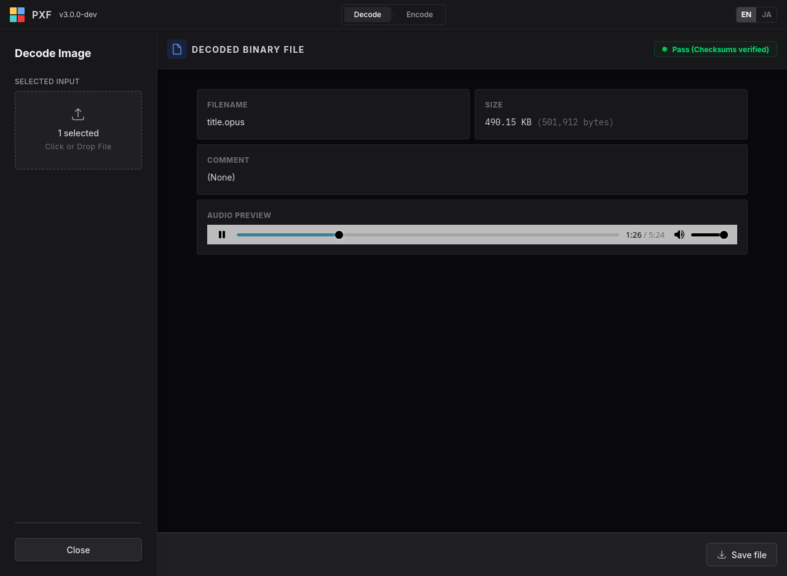

# Pixel Exchange Format

I don't know how this codec even reached version 3.0.0. What the heck.

## Format Overview

The Pixel Exchange Format (PXF) v300 encodes audio or arbitrary binary data into fixed-width images. It combines deterministic transforms, forward error correction, and integrity checks so data can be reconstructed after common image degradation.

## Encoding Modes

PXF supports encoding arbitrary binary data, with a dedicated audio mode for better compression.

### Audio Mode

Stereo is represented as mid/side image pairs, not left/right image channels.

### Binary Mode

Binary mode stores 2480 bytes per data row. Payload symbols are mapped into YCbCr/RGB blocks (2-bit Y + 1-bit Cb + 1-bit Cr), then protected with row LDPC parity and CRC32C.

## Decoding Capabilities

Decoding supports:
- Full reconstruction from complete images
- Streaming/progressive audio decode
- Multi-image reassembly using header random bytes + image indices
- Source grouping by shared 4-byte random header salt

A dedicated UI is used when decoding audio mode, binary mode containing audio, and binary mode containing MIDI.

## Contents

This repo contains various software needed to use the codec:

- The actual codec itself in `codec/`
- A Web UI in order to encode / decode files in `app/`
- A CLI to encode / decode files in the ternimal in `cli/`
- A custom JPEG decoder used by the Web UI and CLI in `jpeg-decoder/`

## License

BSD 3-Clause License (BSD-3-Clause). See `LICENSE`.

Unless otherwise noted, all source code in this repository is licensed under the BSD 3-Clause License.
